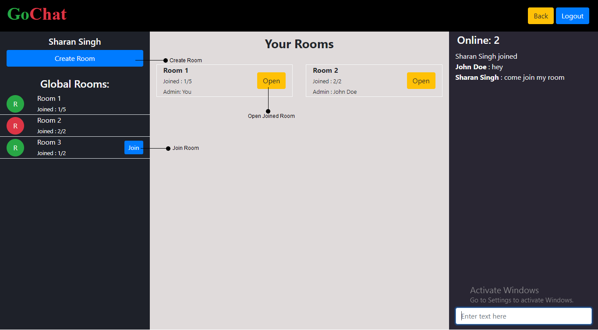

# Group Chat Management - Project Description

URL: http://chat.sharansingh.xyz

API Documentation: http://chat.sharansingh.xyz/apidoc

Socket.IO Events Documentation: http://chat.sharansingh.xyz/eventdoc

### Usage

#### User Management

- To access the app, you need to have an account.
  - **Sign Up**
    - If you don't have an account, create an account, by clicking the "Sign Up".
    - Once you are in the Sign Up page fill the sign up form and submit it.
    - You will receive a mail with an activation link. You click that link, your account will be activated and you will be able to access the account.
  - **Login**
    - If you already have an account, fill the login form at the home page and click the "Login" button
    - Once logged in, you will be taken to the room management page.
    - If you forgot your password, there is a link in the login form to go to the "Forgot Password" page.
    - In the "Forgot Password" page, submit your email. A password reset link will be sent to your email. You need to go that link to create new password. Then login.
  - **Errors**
    - If there are any errors while submitting any form, you either get an error message in the form of an alert box at the top right corner of the page.
- Once you are logged in, you will be taken to a page that looks like the screenshot given above.
- You can create room by clicking on Create Room button.
  - Enter the room name that you want to give.
  - Enter the number of users to be allowed to join the room.
  - Then click create and room will be created.
- You can view global rooms and your rooms on the page. Global rooms are the rooms which are present in the system, while your rooms will be the rooms which are either created by you or joined by you. You will see the Join button in the room if you have not joined it otherwise you will not see the join button.
- There is also global chat window where you can chat with all the online users. It will also show the number of users only in the website curently.

#### Room Management

- Once you create the room, you will be taken to the room management page.
- Here activate or deactivate the room by clicking Activate or Deactivate button respectively.
  - **Deactivated**
    - Your room will be removed from global rooms in lobby. But already joined users can still see your room and join the room from "Your Rooms" section.
  - **Activated**
    - Your room will be visible in Global Rooms and anybody can join the room.
- You can edit the room name or room capacity by clicking Edit button.
- You can delete the room.
- You can Kick any of the user from the room for misbehaviour.
- There is Share button which will copy the url of room and you can send that url to anyone to join.
- Right above the chat input, you will see the person typing currently in the room. For e.g 'John Doe is typing...'
- While performing an operation if error occurs then an alert box with an error message will be displayed at the bottom right corner of the screen.
