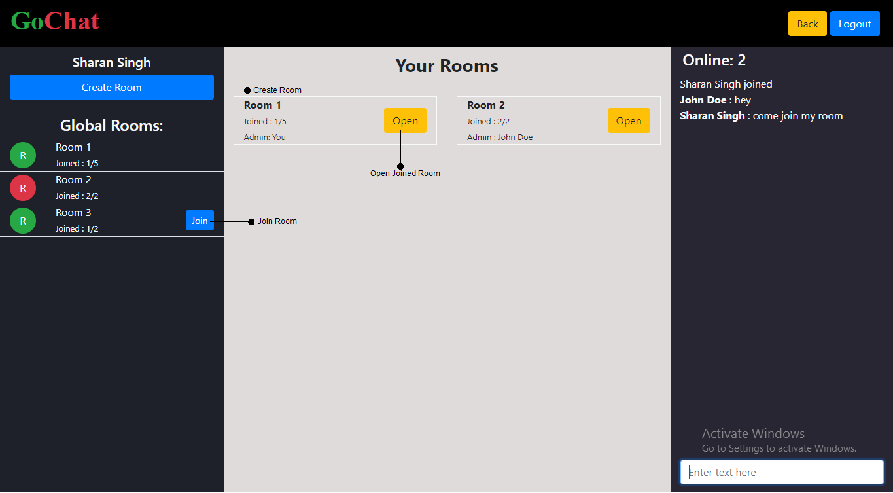
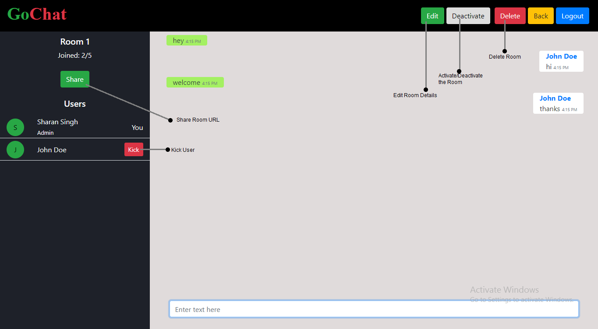

# Chat App

A web app where you can create chat rooms and invite your friends to chat with them. A user can create, delete, activate, deactivate, join and leave active chat rooms as desired.

[Click here](http://chat.sharansingh.xyz) to visit the GoChat.

### Screenshot

<br>


### Built With
* Angular & Bootstrap - Frontend
* Node.JS & Express - Backend
* MongoDB - Server
* Socket.IO
* Redis

### Prerequisites
1. MongoDB
2. NodeJS


### Running the App

The steps you need to follow (assuming MongoDB server is running):

```shell
git clone https://github.com/sharan3009/GoChat-app.git
cd GoChat-app/GoChat-Backend
npm install
node app
```